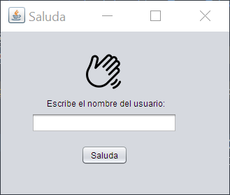
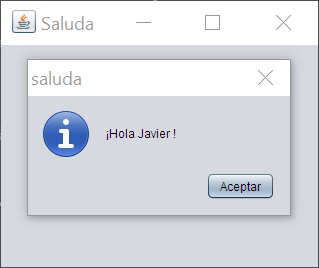

# Práctica 2.2 JFrame saludo inicial

## Parte 1

Crea una ventana que muestre un icono de saludo, pida el nombre de usuario y un botón **saluda**.   
Al pulsarlo deberá saludar por el nombre contenido en dicho campo.

Modifica las propiedades de la ventana para que no se pueda redimensionar y se abra en el medio de la pantalla.

 

## Parte 2

Mejorar el ejercicio anterior para que además de nombre, haya otro campo de apellidos del que muestre el saludo *nombre+apellidos* en la ventana posterior. Después de saludar deberán borrarse los campos introducidos. 

Además deberán de hacerse las siguientes validaciones mostrando un cuadro de diálogo mostrando un error en caso de que no se cumplan:
- Validar que ninguno de los dos campos esté vacío.
- Validar que la longitud del nombre sea al menos de 5 caracteres.
- Validar que no aparece ningún símbolo numérico en el campo nombre o apellidos.
 
